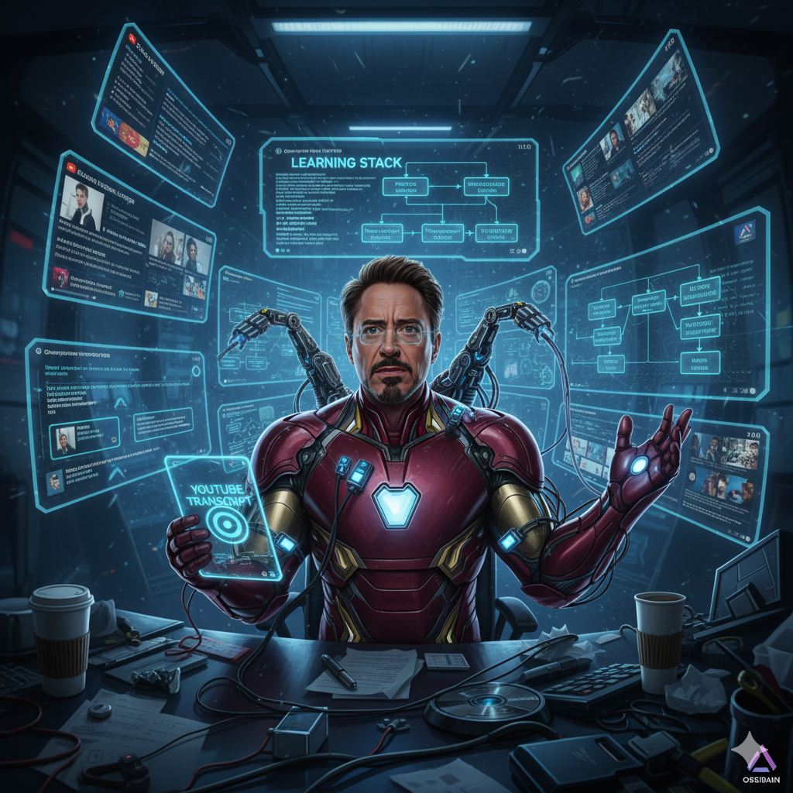
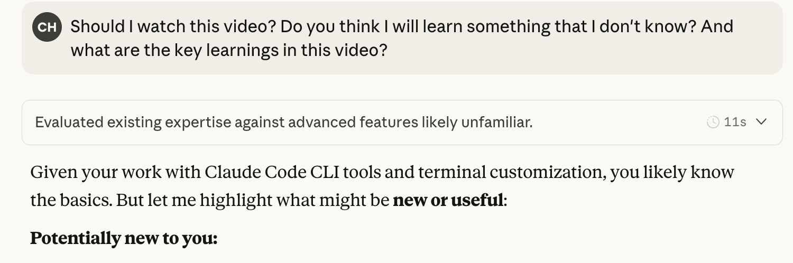
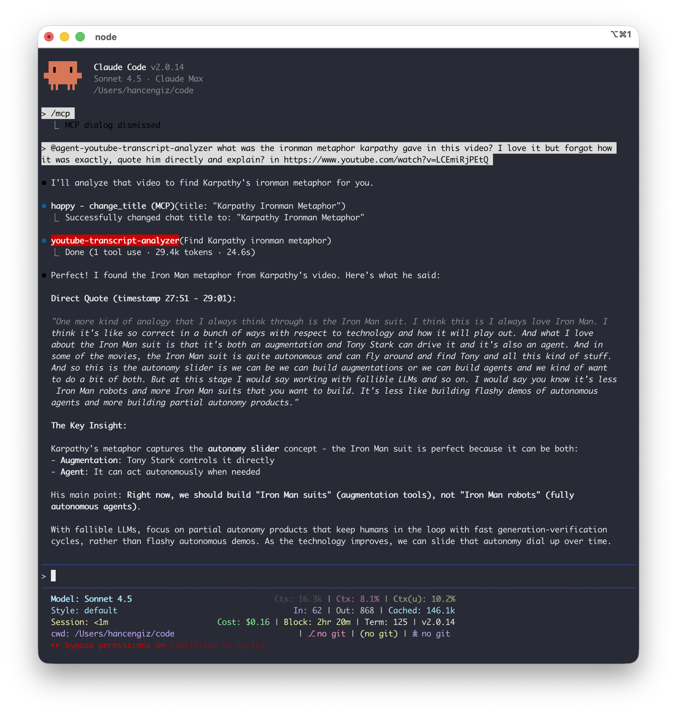

# One More Piece Built: Adding YouTube Analysis to My Learning Iron Man Suit

Look, I have a problem. There are too many videos to watch, too little time, and my YouTube "Watch Later" list has become a graveyard of good intentions. You know how it goes:

- Someone shares a 2-hour podcast about AI agents
- Hacker News links to a 90-minute technical talk
- A friend recommends a 45-minute tutorial on some framework
- That conference keynote everyone's talking about

And I'm supposed to... what? Watch all of them? At 1.5x speed while taking notes? Please.

So I did what any reasonable developer would do: **I turned Claude Code into my learning assistant.** And honestly, it's kind of changed everything.

## The PDF Reader Was Just the Beginning

A few weeks ago, I [built a PDF reader MCP tool](https://www.cengizhan.com/p/vibe-coded-a-pdf-reader-mcp-tool) because I was tired of wasting context tokens on big consultancy reports. The idea was simple: let Claude read the PDF in its own context, extract the insights, and give me just the good stuff.

It worked beautifully.

Then I thought: "Wait... what about YouTube videos?"

## The YouTube Problem

Here's my typical YouTube workflow (or lack thereof):

**Before (The Chaos Era):**
1. See an interesting video link
2. Add to "Watch Later" (population: 347 videos)
3. Never watch it
4. Feel vaguely guilty
5. Repeat

**OR:**

1. Actually watch the video
2. Spend 60 minutes watching a 60-minute video (shocking, I know)
3. Pause constantly to ChatGPT prompt the mentioned technology or framework
4. Open 15 tabs researching that product
5. Go down a rabbit hole for 30 minutes
6. Forget I was even watching a video
7. Come back confused about what the video was about
8. Forget most of it within a week
9. Can't remember which video had that one good quote
10. Rinse and repeat

There had to be a better way.



## Enter: YouTube Transcript MCP + Claude Code

So I built another tool. (Yeah, I know. 🤓)

The [YouTube Transcript MCP server](https://github.com/hancengiz/youtube-transcript-mcp) does exactly what you think it does: fetches YouTube video transcripts and lets Claude analyze them.

But here's where it gets interesting.

## My New Learning Workflow: The "Maybe I'll Watch It" Filter

Now when someone sends me a video, I have a conversation with Claude Desktop or Claude Code that looks like this:

**Me:**
> "Should I watch this video? Do you think I will learn something that I don't know? And what are the key learnings in this video?"

Here's what that actually looks like:



**Claude doesn't just summarize the video.** It evaluates what I already know against what's in the video, then tells me what's actually NEW or useful for ME specifically.

In this example:
> "Given your work with Claude Code CLI tools and terminal customization, you likely know the basics. But let me highlight what might be **new or useful**..."

**Decision made in 30 seconds.** Watch it, don't watch it, or jump to the good parts.

It's like having a hyper-intelligent friend who:
- Already watched everything
- Knows what you already know
- Can tell you if it's worth your time
- Highlights only what's NEW to you

This is next-level content triage.

The screenshot above is just the beginning. Claude doesn't stop at "should you watch this?" - it goes deeper:

**After evaluating my existing knowledge**, Claude continues with:
- Potentially new concepts I haven't explored
- Specific timestamps for topics worth my attention
- Whether the video's depth matches what I need (introductory vs. advanced)
- Actionable next steps based on the content

It's not just content filtering. **It's personalized learning recommendations based on what I already know.**

And here's the thing: Claude Code remembers our conversation history. So over time, it builds a model of what I know, what I'm interested in, and what's worth my time.

It's like having a learning coach who actually pays attention.

## The "Extract Key Learnings" Superpower

But it gets better. Sometimes I use Claude to extract insights BEFORE I watch:

**Me:**
> "Get the key learnings from this Karpathy talk, especially anything about LLM limitations"

**Claude:**
> "Here are the 7 key insights about LLM limitations:
> 1. **Anterograde amnesia**: LLMs don't consolidate long-term memory...
> 2. **Jagged intelligence**: Superhuman at some tasks, make errors no human would...
> 3. **Hallucinations**: They're 'stochastic simulations of people spirits'...
> [continues with structured insights]"

Now when I DO watch the video, I'm not passively consuming. I'm looking for:
- Nuance I missed in the transcript
- Visual examples that add context
- The "vibe" of how they explain things
- Specific moments worth clipping

**I've turned watching into active learning instead of passive consumption.**

### Even Better: Ask Specific Questions About Videos

Here's where it gets really powerful. Remember that one metaphor from a video you loved? Instead of scrubbing through trying to find it, just ask:

**Me:**
> "@agent-youtube-transcript-analyzer what was the ironman metaphor karpathy gave in this video? I love it but forgot how it was exactly, quote him directly and explain? in https://www.youtube.com/watch?v=LCEmiRjPEtQ"

Here's what that looks like:



**The result?** Claude finds the exact quote with timestamp (27:51-28:31) and gives me:

> **The Exact Quote:**
>
> "One more kind of analogy that I always think through is the Iron Man suit... what I love about the Iron Man suit is that it's both an augmentation and Tony Stark can drive it and it's also an agent... this is the autonomy slider is we can build augmentations or we can build agents and we kind of want to do a bit of both."
>
> **He then adds:**
>
> "But at this stage I would say working with fallible LLMs and so on... it's less Iron Man robots and more Iron Man suits that you want to build. It's less like building flashy demos of autonomous agents and more building partial autonomy products."

**This is huge.** No more:
- Scrubbing through the video trying to find that moment
- Pausing and writing down timestamps
- Giving up and just saying "somewhere around the middle"

Just ask. Get the exact quote. With timestamp. And explanation.

It's like having Cmd+F for video content.

**Karpathy says build Iron Man suits, not Iron Man robots?** Well, this MCP tool and workflow is my way of building my own Iron Man suit, one more piece built! 🦾

(See what I did there? Meta.)

## The Real Magic: Context Efficiency with Sub-Agents

Here's the nerdy part (you can skip if you want, but it's cool):

When Claude fetches a 60-minute video transcript, that's about 20,000-30,000 tokens of text. If that goes into my main conversation, I can only analyze 2-3 videos before my context fills up.

But Claude Code has this feature called "sub-agents" - basically, temporary specialized agents that handle tasks in their own context and return only the results.

So now:
- Sub-agent fetches the transcript (in its own context)
- Sub-agent analyzes the video
- Sub-agent returns ONLY the insights (~2k tokens)
- My main context stays clean

**Result:** I can analyze 10+ videos in one session, compare them, extract patterns, and still have room for a deep conversation about what I'm learning.

It's like having unlimited working memory for learning.

**Want to create your own sub-agent for this MCP tool?** Check out the [complete guide to setting up the youtube-transcript-analyzer agent](https://github.com/hancengiz/youtube-transcript-mcp/blob/main/CLAUDE_CODE_AGENT_GUIDE.md) - includes full configuration, examples, and how to customize it for your workflow.

## Real Use Cases (That Actually Changed How I Learn)

### 1. **The Conference Sprint**

Recently needed to catch up on AI agent developments. Instead of blocking out 8 hours:

```
Me: "Analyze these 5 talks about AI agents and tell me:
     - What everyone agrees on
     - What they disagree about
     - What's hype vs. reality"

Claude: *analyzes all 5 videos in parallel*

Result: 30-minute synthesis vs. 8 hours of watching
```

### 2. **The "Should I Learn This Framework?" Decision**

Friend: "You should learn OpenSpec! Watch this tutorial!"

```
Me: "What are the key selling points of OpenSpec from this tutorial?
     How does it compare to other API specification tools? Is it worth adopting?"

Claude: *analyzes tutorial*
        "Main innovations: [key features]...
         Worth learning if: [specific criteria]
         Stick with current tools if: [other criteria]"

Decision made. No 2-hour commitment required.
```

### 3. **The "Extract All the Actionable Advice" Power Move**

Productivity videos are 90% fluff, 10% gold. Let Claude find the gold:

```
Me: "Extract all actionable advice from this video.
     Format as a checklist I can actually use."

Claude: Returns 12-point checklist with timestamps
```

No more "I remember they said something useful but what was it?"

### 4. **The "Deep Research Mode"**

This is my favorite. When I'm researching a topic:

```
Session 1: Analyze foundational video A
Session 2: Analyze contrarian take from video B
Session 3: Compare both perspectives
Session 4: "Based on everything we've discussed, what's your synthesis?"

Claude: Creates a framework combining insights from multiple sources
```

**I'm not just consuming content anymore. I'm synthesizing knowledge with an AI partner.**

## The Learning Stack (PDF + YouTube + Claude Code)

So now my learning stack looks like this:

**Research Papers?** → PDF Reader MCP → Claude analyzes, I get insights

**YouTube Videos?** → YouTube Transcript MCP → Claude analyzes, I decide if worth watching

**Want to go deep?** → Sub-agents handle the heavy lifting, main context stays clean

**Need synthesis?** → Claude connects dots across everything I've analyzed

It's like having a research assistant who:
- Never gets tired
- Reads/watches everything instantly
- Remembers all the details
- Can compare and synthesize across sources
- Actually answers "is this worth my time?"

## The Controversial Take: Do I Even Need to Watch Videos Anymore?

Here's where it gets weird.

For some videos, **I don't watch them at all**. I just get the transcript analysis and move on. I've only been using this approach for the last week, so time will tell. But the whole idea of having this is to be able to skip videos that I don't even need to spend my time on.

For others, I watch AFTER getting the analysis. And you know what? **I get way more out of them.** Because I know what to look for. I'm watching with intention.

It's like the difference between:
- Reading a book vs. skimming it
- Studying with notes vs. cramming
- Active learning vs. passive consumption

**The transcript analysis is the appetizer. Watching with context is the main course.**

(Though sometimes the appetizer is enough and I skip the main course. Don't judge me.)

## The Meta Moment

The irony isn't lost on me: I built a tool to help me decide what to watch, and now I watch more thoughtfully but less frequently.

Claude Code isn't replacing my learning. **It's optimizing my learning pipeline:**

- **Filter:** What's actually worth my time?
- **Extract:** What are the key insights?
- **Synthesize:** How does this connect to what I already know?
- **Decide:** Do I need to go deeper?

I'm learning more, watching less, and retaining better.

## How You Can Do This Too

If you want to try this workflow:

**1. Install the YouTube Transcript MCP**

```bash
npm install -g @fabriqa.ai/youtube-transcript-mcp
```

Add to your `~/.claude.json`:

```json
{
  "mcpServers": {
    "youtube-transcript": {
      "command": "npx",
      "args": ["@fabriqa.ai/youtube-transcript-mcp@latest"]
    }
  }
}
```

**2. Use sub-agents for context efficiency:**

```
"Use sub-agent to analyze this video and give me key learnings:
[YouTube URL]"
```

**3. Start small:**

- Pick one video from your "Watch Later" list
- Ask Claude: "Should I watch this? What are the key points?"
- See if it's worth 60 minutes of your time

**4. Go deeper:**

- Analyze multiple videos on the same topic
- Ask Claude to compare perspectives
- Build your own synthesized understanding

## What's Next? (Hint: Obsidian)

Okay, so I have PDFs covered. YouTube videos? Check. But I'm not stopping here.

**Next up: Obsidian integration.**

Imagine this workflow:
1. Claude analyzes a video and extracts key learnings
2. Automatically creates an Obsidian note with:
   - Summary and key insights
   - Timestamps and quotes
   - Links to related notes in my knowledge base
   - Tags based on content
3. Builds connections to other videos/papers I've analyzed
4. Creates a personal knowledge graph that actually works

**The goal?** Turn my scattered learning into a connected knowledge system. No more "where did I read that thing about agents?" - just ask Claude to search my Obsidian vault.

I'm basically building my own personalized learning infrastructure, one MCP tool at a time.

Stay tuned. This is going to be fun. 🧠

## The Bottom Line

Look, I'm not trying to revolutionize education here. I just wanted to stop drowning in unwatched videos and start actually learning.

But what started as "I need to manage my context tokens" turned into **a completely different relationship with learning.**

Claude Code isn't just a coding assistant anymore. It's my:
- Content triage system
- Research assistant
- Learning partner
- Synthesis engine
- **Soon-to-be knowledge management system**

And honestly? **It's kind of magical.**

Now if you'll excuse me, I have 347 videos in my "Watch Later" list to analyze.

Or not. Claude will tell me which ones are worth it.

And then automatically organize the insights into my Obsidian vault.

---

**Tools mentioned:**
- [YouTube Transcript MCP](https://github.com/hancengiz/youtube-transcript-mcp) - GitHub
- [PDF Reader MCP](https://www.cengizhan.com/p/vibe-coded-a-pdf-reader-mcp-tool) - Previous blog post
- [Claude Code](https://docs.claude.com/claude-code) - The AI coding assistant that became my learning assistant

---

*P.S. - Yes, I wrote this blog post with Claude Code. Here's how that actually works:*

*I gave Claude a draft blueprint of what I wanted to cover—my ideas, my experiences, my unique perspective. Then I had Claude Code generate the text. These are all my ideas, my intellectual property. It's not "AI-generated" in the sense that AI came up with it—the text is written by AI, but the thoughts are mine.*

*Think of it like AI-assisted coding: You create the specification and design for your software, the AI-assisted tool generates the code, but it's still YOUR software because you did the design and put your intellectual property into it. You iterate—modify the spec, adjust the prompt, refine the output—until you get what you wanted. Kind of like vibe coding, but for writing.*

*That's exactly how I write these articles. I provide the blueprint and ideas, Claude generates the text, and then I iterate until it matches what I wanted to say.*

*So yes, that's meta. No, I don't care. We're living in the future, folks.*
